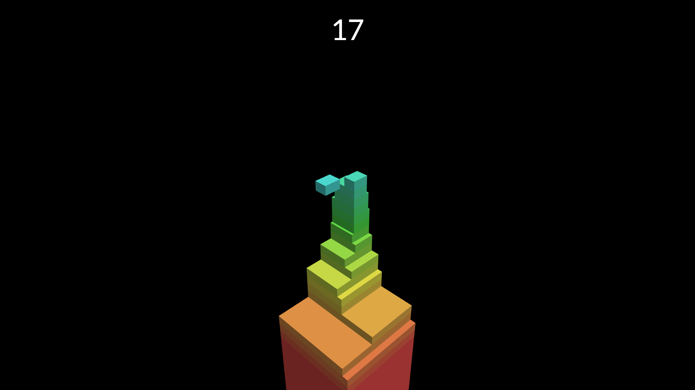

# Stack
Stack game clone made with Three.js

## Live
You can play now [here](https://konradlinkowski.github.io/Stack/)



## Installation
```
# install dependencies
yarn install
# run the game
yarn start
# alternatively run the dev server
yarn dev
```

## Contributing
Feel free to create issues and pull requests with your ideas or bug reports :)

## Todo
- gameplay
  - [x] spawning tiles
  - [x] cutting tiles
  - [ ] saving the best score
  - [ ] graphic and audio settings
  - [ ] keyboard support
- graphics
  - [x] lighting
  - [x] hue changing
  - [ ] better camera angle
  - [ ] cut fragment should fall off or fade out
- audio
  - [ ] background music
  - [ ] sound effects

The code probably need a major refactor anyway

## License
[MIT](./LICENSE)
